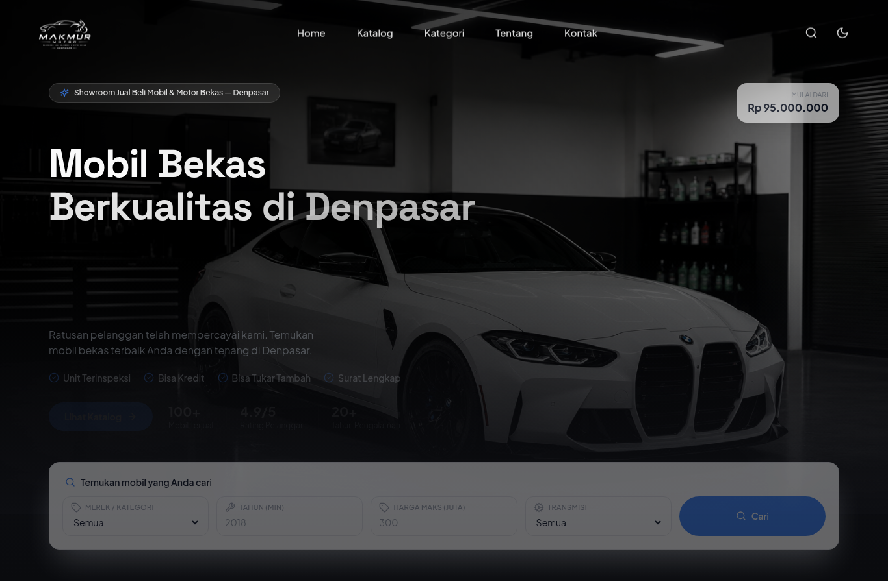
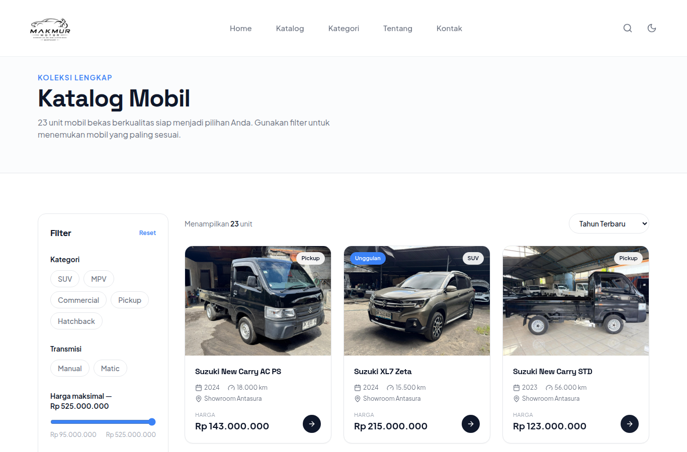
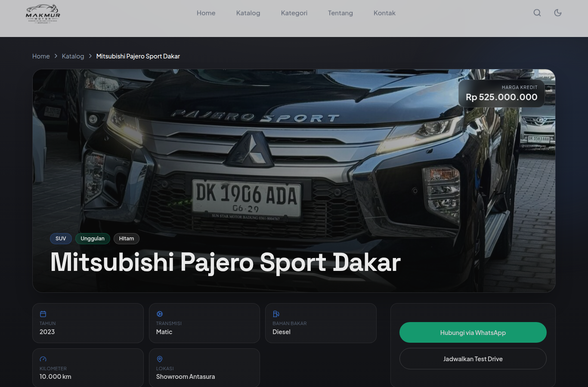
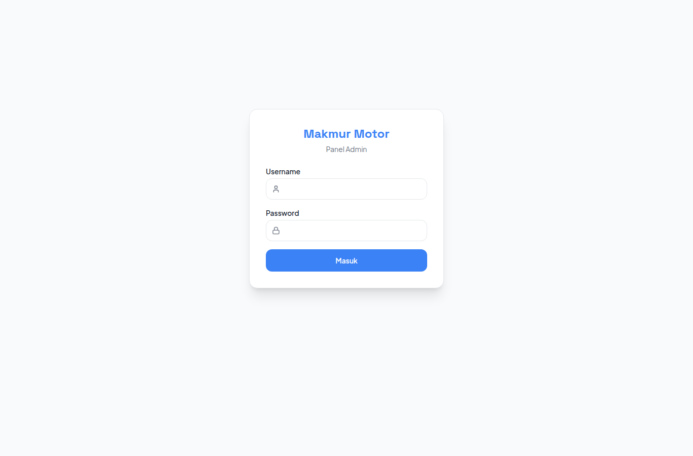

<div align="center">


# Makmur Motor — Premium Car Showroom

**Website showroom jual–beli mobil bekas berkualitas di Denpasar, Bali**
dengan panel admin lengkap untuk mengelola inventori secara mandiri.

[🌐 Live Demo](https://makmurmotor.biz.id) ·
[📦 Katalog](https://makmurmotor.biz.id/katalog) ·
[🔐 Panel Admin](https://makmurmotor.biz.id/admin)


</div>

---



## ✨ Tentang

**Makmur Motor** adalah website showroom modern yang menampilkan inventori mobil
secara dinamis dari database, dilengkapi **panel admin** sehingga pemilik dapat
**menambah, mengedit, menghapus, dan menandai mobil terjual** — termasuk
**mengunggah foto** — tanpa perlu menyentuh kode. Seluruh aplikasi berjalan di
**Cloudflare Workers** (edge, global, cepat) dengan **Cloudflare D1** sebagai
database dan **Cloudflare KV** sebagai penyimpanan foto.

## 🎯 Fitur

### Untuk Pengunjung
- **Beranda premium** — hero parallax + split-text, kategori, mobil unggulan,
  keunggulan, promo (tombol magnetic), testimoni, lokasi showroom.
- **Katalog** dengan filter (kategori, transmisi, lokasi, rentang harga, tahun),
  sorting, dan **filter yang bisa dibagikan lewat URL**.
- **Halaman detail mobil** — galeri foto dengan lightbox, spesifikasi lengkap,
  dan mobil serupa.
- **Integrasi WhatsApp** — tombol mengambang + tombol per mobil dengan pesan
  otomatis.
- **Dark mode**, animasi level Figma/After Effects (Framer Motion), responsif
  penuh, dan menghormati `prefers-reduced-motion`.
- **SEO** — metadata per halaman, OpenGraph, JSON-LD (AutoDealer + Product),
  `sitemap.xml` dinamis, `robots.txt`.

### Untuk Admin (`/admin`)
- 🔐 **Login aman** (1 akun admin, sesi cookie bertanda tangan HMAC).
- ➕ **Tambah mobil** baru lengkap dengan spesifikasi.
- ✏️ **Edit mobil** — ubah harga, KM, status unggulan, dll.
- 🗑️ **Hapus mobil** secara permanen.
- 🏷️ **Tandai TERJUAL** — mobil otomatis **disembunyikan** dari situs publik,
  tetapi tetap tersimpan di panel dan bisa ditampilkan lagi.
- 📸 **Upload foto** langsung dari panel (drag & drop), atur **sampul** dan
  hapus foto per unit.

## 📸 Tampilan

| Katalog + Filter | Detail Mobil |
| --- | --- |
|  |  |

| Login Admin |
| --- |
|  |

## 🏗️ Arsitektur

```
Pengunjung ─┐
            ├─►  Cloudflare Worker (Next.js 15 via OpenNext)
Admin ──────┘          │
                       ├─►  D1 (SQLite)   — data mobil
                       ├─►  KV            — foto hasil upload (/api/images/*)
                       └─►  Workers Assets — foto seed & aset statis (/cars/*)
```

- **Next.js 15 App Router** dijalankan di Workers memakai
  [`@opennextjs/cloudflare`](https://opennext.js.org/cloudflare).
- **Drizzle ORM** untuk akses D1 yang type-safe (`lib/db/`).
- **Auth** kustom tanpa dependency berat: PBKDF2-SHA256 untuk password +
  HMAC-SHA256 untuk token sesi (`lib/auth.ts`), dilindungi `middleware.ts`.
- Halaman publik membaca D1 per request (selalu fresh); mobil **SOLD**
  disaring di lapisan query (`lib/db/queries.ts`).

## 🛠️ Teknologi

Next.js 15 · React 19 · TypeScript 5 · Tailwind CSS 3.4 · Framer Motion ·
Drizzle ORM · Cloudflare Workers / D1 / KV · OpenNext · lucide-react · Zod.

## 🚀 Menjalankan Secara Lokal

Prasyarat: **Node.js 18.18+** (disarankan 20+) dan npm.

```bash
# 1. Install dependencies
npm install

# 2. Siapkan secrets lokal
cp .env.example .dev.vars
#    lalu isi ADMIN_PASSWORD_HASH (lihat di bawah) dan SESSION_SECRET

# 3. Siapkan database lokal (D1 + seed inventori awal)
npm run db:migrate:local
npm run db:seed:local

# 4. Jalankan dev server (http://localhost:3000)
npm run dev
```

**Membuat hash password admin:**

```bash
node scripts/hash-password.ts "password-pilihan-anda"
# salin output ke ADMIN_PASSWORD_HASH di .dev.vars

# SESSION_SECRET bisa dibuat dengan:
openssl rand -hex 32
```

## ☁️ Deploy ke Cloudflare

```bash
# Login wrangler (atau set CLOUDFLARE_API_TOKEN + CLOUDFLARE_ACCOUNT_ID)
npx wrangler login

# 1. Buat resource (sekali saja) — id otomatis masuk ke wrangler.jsonc
npx wrangler d1 create makmur-motor-db
npx wrangler kv namespace create MEDIA_KV

# 2. Migrasi + seed database produksi
npm run db:migrate:remote
npm run db:seed:remote

# 3. Set secrets produksi
npx wrangler secret put ADMIN_USERNAME
npx wrangler secret put ADMIN_PASSWORD_HASH
npx wrangler secret put SESSION_SECRET

# 4. Build + deploy
npm run deploy
```

> Foto yang diunggah lewat panel admin disimpan di **Cloudflare KV** dan
> disajikan via route `/api/images/...`, jadi **tidak butuh R2**.

## 🗂️ Struktur Proyek

```
app/
├── layout.tsx              # Root: font, metadata, JSON-LD, ThemeProvider
├── (site)/                 # Situs publik (navbar + footer)
│   ├── layout.tsx
│   ├── page.tsx            # Beranda
│   ├── katalog/page.tsx    # Katalog + filter
│   └── mobil/[id]/page.tsx # Detail mobil
├── admin/                  # Panel admin (dilindungi middleware)
│   ├── login/page.tsx
│   ├── page.tsx            # Dashboard
│   └── mobil/[baru|[id]]/  # Form tambah / edit
├── api/
│   ├── cars/route.ts       # API publik
│   ├── admin/...           # Login, CRUD, sold, upload
│   └── images/[...key]/    # Penyaji foto dari KV
├── sitemap.ts · robots.ts

lib/
├── db/{schema,index,queries}.ts  # Drizzle + D1
├── auth.ts                        # Hash password + sesi
├── validation.ts                  # Skema Zod
├── data.ts                        # Sumber data seed + meta kategori
└── utils.ts · contact.ts · photos.ts · thumbnails.ts

components/  · admin/ · car-detail/ · filter/ · ui/
scripts/     # build-seed.ts, hash-password.ts
drizzle/     # migrasi SQL
```

## 📞 Kontak

- **WhatsApp:** 081259174400
- **Email:** makmurmotorantasura@gmail.com
- **TikTok:** [@makmurmotordps](https://www.tiktok.com/@makmurmotordps)

---

<div align="center">
© Makmur Motor — Denpasar, Bali.
</div>
